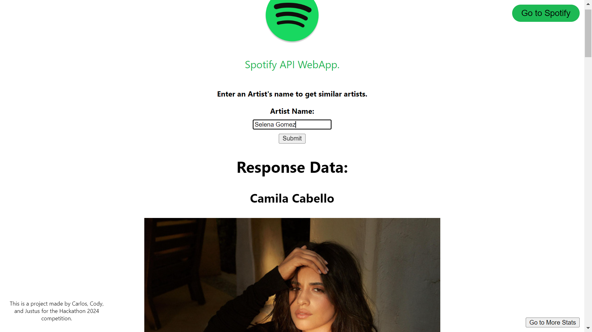

# AuburnHacks GitHub Repository - Cody, Justus, Carlos
This is Cody, Justus, and Carlos' 2024 Hackathon project.
## Prompt Chosen
- Make a new, creative Spotify stats website using the Spotify API.
    - Sentiment analysis could be used to determine overall mood of top songs/artists.

## Project Summary

### Inspiration
Spotify Wrapped was our inspiration for this web application. We wanted to display interesting statistics from the Spotify API through a web application.

### What it does
Sound Safari is a web application that takes an Artist's name and returns the top 5 most related artists on Spotify. There is also another function to get more stats where we used dashboards and the Spotify API to display more interesting statistics.

### How we built it
- We familiarized ourselves with the Spotify API.
- We developed the front and back end simultaneously.
- We also developed dashboards to display other statistics through the Spotify API.
- We integrated the front and back end with a way to access the dashboards. 

### Challenges we ran into
None of us had ever used Spotify API and the front end development started out very slow because of problems with Vue and Node. After a few hours, those problems were fixed and we started to develop an actual project.

### Accomplishments that we're proud of
As a team, we are proud of creating and finishing a front and back end for our web application and integrating them together.

### What we learned
We learned how to start from scratch and develop a full front and back end system using the Spotify API.

### What's next for Sound Safari
In the future, if we were to continue to develop this web application and data analysis tool, we would add more pages with more stats, make it look more professional, and try to improve the overall User Experience.

